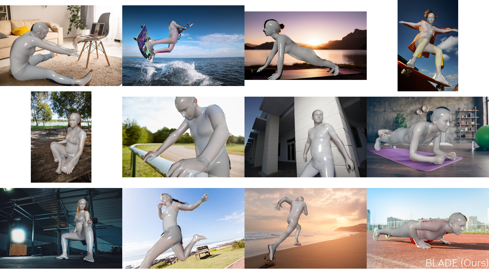
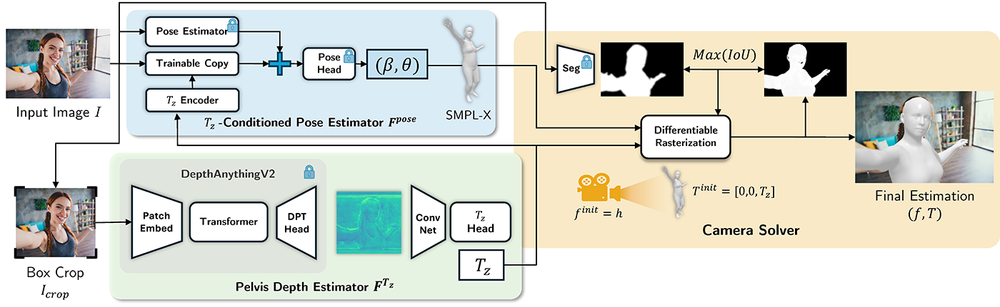
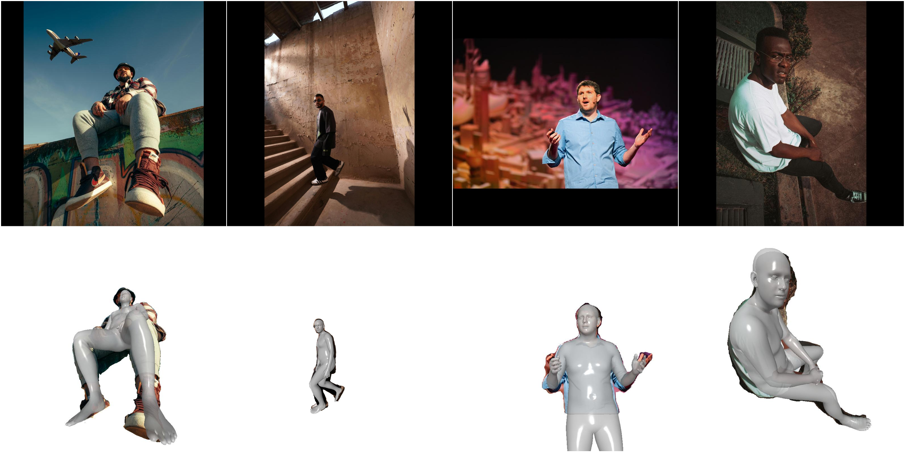

# BLADE: Single-view Body Mesh Estimation through Accurate Depth Estimation (CVPR 2025)

[](https://openaccess.thecvf.com/content/CVPR2025/papers/Wang_BLADE_Single-view_Body_Mesh_Estimation_through_Accurate_Depth_Estimation_CVPR_2025_paper.pdf)
[](https://research.nvidia.com/labs/amri/projects/blade/)

**Authors:** Shengze Wang, Jiefeng Li, Tianye Li, Ye Yuan, Henry Fuchs, Koki Nagano*, Shalini De Mello*, Michael Stengel*\
*denotes equal contribution

<p align="center">
  
</p>


## Overview
Unlike prior methods that avoid camera recovery and only work well for subjects far from the camera, BLADE tackles **close-range human mesh recovery** where perspective distortion is strongest in 3 steps:

1. **Predicts pelvis depth (Tz)**: directly from the image
2. **Conditions pose/shape on Tz**: the same shape/pose can look different at different distances
3. **Recovers full perspective camera**: focal length and XY-translation through differentiable rasterization

### Key Features
- ✅ **True perspective HMR**: recovers focal length and full 3D translation without heuristics
- ✅ **Close-range robust**: strong performance under severe perspective distortion
- ✅ **3D Accurate & 2D Aligned**: improved 3D pose, metrical depth, and 2D reprojection alignment

<p align="center">
  
</p>

## 📚 Citation & Acknowledgement

```bibtex
@inproceedings{wang2025blade,
  title     = {BLADE: Single-view Body Mesh Estimation through Accurate Depth Estimation},
  author    = {Wang, Shengze and Li, Jiefeng and Li, Tianye and Yuan, Ye and Fuchs, Henry and Nagano, Koki and De Mello, Shalini and Stengel, Michael},
  booktitle = {Proceedings of the IEEE/CVF Conference on Computer Vision and Pattern Recognition (CVPR)},
  year      = {2025}
}
```

BLADE builds on the outstanding work and open-source contributions of many teams. We thank:

- **[MMHuman3D](https://github.com/open-mmlab/mmhuman3d)** — dataset preprocessing utilities, evaluation protocols, and loaders that informed our data pipeline.

- **[ZOLLY & PDHuman](https://github.com/SMPLCap/Zolly)** — PDHuman dataset and related preprocessing guidance and ZOLLY as baseline.

- **[SMPL](https://smpl.is.tue.mpg.de/) & [SMPL-X](https://smpl-x.is.tue.mpg.de/) body models (MPI-IS)** — foundational parametric human body models.

- **[Depth Anything v2 (metric)](https://huggingface.co/depth-anything)** — depth encoder's features are used in our DepthNet.
  
- **[MediaPipe](https://chuoling.github.io/mediapipe/) & [Sapiens Pose](https://huggingface.co/facebook/sapiens-pose-1b) & [RTMDet](https://github.com/open-mmlab/mmdetection)** — human segmenter and keypoint models used in our preprocessing pipeline.

- **[AiOS](https://github.com/SMPLCap/AiOS) & [ControlNet](https://github.com/lllyasviel/ControlNet)** — basis for our pelvis-depth conditioned PoseNet.

- **Datasets** — We gratefully acknowledge the following datasets used for training/evaluation and comparisons:
**[HuMMan](https://caizhongang.com/projects/HuMMan/)**, **[Human3.6M](https://vision.imar.ro/human3.6m/)**, **[PDHuman](https://github.com/SMPLCap/Zolly)**, **[SPEC](https://spec.is.tue.mpg.de/)**, **[BEDLAM](https://bedlam.is.tue.mpg.de/)** (basis for our BEDLAM-CC renders)  

If you use BLADE in your research, please also **cite the original works** for any datasets/models you use alongside our paper.

For business inquiries, please visit our website and submit the form: [NVIDIA Research Licensing](https://www.nvidia.com/en-us/research/inquiries/).

## 🛠️ Installation

### Prerequisites
- CUDA 11.8 recommended. guide for CUDA 13 also provided
- Python 3.9.19
- Conda

### Quick Installation (CUDA 11.8)
```bash
# Create environment
apt-get install git-lfs
git lfs install

git clone https://github.com/NVlabs/BLADE

conda create -n blade_env python=3.9.19
conda deactivate && conda activate blade_env

# pytorch stuff
pip install tqdm torch==2.0.1+cu118 torchvision==0.15.2+cu118 --extra-index-url https://download.pytorch.org/whl/cu118 && pip install fvcore iopath numpy==1.24.4 && pip install wandb && pip install --no-index --no-cache-dir pytorch3d -f https://dl.fbaipublicfiles.com/pytorch3d/packaging/wheels/py39_cu118_pyt201/download.html && pip install --no-warn-conflict matplotlib==3.8.4 colorama requests huggingface-hub safetensors pillow six click openxlab && pip install --no-warn-conflict chumpy scipy munkres tqdm cython fsspec yapf==0.40.1 packaging omegaconf ipdb ftfy regex && pip install --no-warn-conflict json_tricks terminaltables modelindex prettytable albumentations && pip install --no-warn-conflict smplx==0.1.28 debugpy numba yacs scikit-learn filterpy h5py trimesh scikit-image tensorboardx pyrender torchgeometry joblib boto3 easydict pycocotools colormap pytorch-transformers pickle5 plyfile timm pyglet future tensorboard cdflib ftfy einops && pip install --no-warn-conflict numpy==1.23.1 mediapipe
# MMCV stuff
cd mmcv; MMCV_WITH_OPS=1 pip install --no-warn-conflicts -e . -v; pip install --no-warn-conflicts -e .; cd ..; cd sapiens; cd engine; pip install --no-warn-conflicts -e . -v; cd ../pretrain; pip install --no-warn-conflicts -e . -v; cd ../pose; pip install --no-warn-conflicts -e . -v; cd ../det; pip install --no-warn-conflicts -e . -v; cd ../seg; pip install --no-warn-conflicts -e . -v; cd ../..; pip install --no-warn-conflicts -e .;
pip install --no-warn-conflict ffmpeg astropy easydev pandas rtree vedo codecov flake8 interrogate isort pytest surrogate xdoctest setuptools loguru open3d omegaconf
cd aios_repo/models/aios/ops/; python setup.py build install; cd ../../../..; cd torch-trust-ncg; python setup.py install; 
cd ..; pip install  --no-warn-conflict numpy==1.23.1
```

> **Note:** Ignore numpy version warnings - they don't affect functionality.

### For CUDA 13+ Users
See [INSTALL_CUDA13.md](docs/INSTALL_CUDA13.md) for detailed CUDA 13+ setup instructions.


## 📦 Download Models

### Required Models
```bash
# Install HuggingFace CLI
pip install "huggingface_hub[cli]"
# Note: You might need to set up your HuggingFace token in order to download

# Download BLADE checkpoint
Pretrained weights are personally provided by Shengze Wang 
Please check https://mcmvmc.github.io/blade_weights.html 

# If you are on SLURM and limited by disk quota, redirect the download directories
export HF_HOME=</path/to/.cache/>; 
export TORCH_HOME=</path/to/.cache/>; 
export WANDB_DIR=</path/to/.wandb_cache/>; 

# Download supporting models
hf download depth-anything/Depth-Anything-V2-Metric-Hypersim-Large depth_anything_v2_metric_hypersim_vitl.pth --local-dir pretrained/model_init_weights
hf download ttxskk/AiOS aios_checkpoint.pth --local-dir pretrained/model_init_weights
hf download facebook/sapiens-pose-bbox-detector rtmdet_m_8xb32-100e_coco-obj365-person-235e8209.pth --local-dir pretrained/rtmpose
hf download facebook/sapiens-pose-1b sapiens_1b_goliath_best_goliath_AP_639.pth --local-dir pretrained/pose
```

### SMPL/SMPL-X Models (Manual Download Required)
Due to licensing restrictions, download these manually:
- **SMPL**: [Download from official site](https://smpl.is.tue.mpg.de/) → place in `body_models/smpl/`
- **SMPL-X**: [Download from official site](https://smpl-x.is.tue.mpg.de/) → place in `body_models/smplx/`
- **Transfer data**: [Download from SMPL-X repo](https://github.com/vchoutas/smplx/blob/main/transfer_model/README.md) → place in `pretrained/transfer_data/`

### Expected Directory Structure
```
blade_repo/
├── body_models/
│   ├── smpl/          # SMPL models (manual download)
│   └── smplx/         # SMPL-X models (manual download)
├── pretrained/
│   ├── epoch_2.pth    # BLADE checkpoint
│   ├── model_init_weights/
│   │   ├── depth_anything_v2_metric_hypersim_vitl.pth
│   │   └── aios_checkpoint.pth
│   ├── rtmpose/
│   │   └── rtmdet_m_8xb32-100e_coco-obj365-person-235e8209.pth
│   ├── pose/
│   │   └── sapiens_1b_goliath_best_goliath_AP_639.pth
│   └── transfer_data/ # SMPL conversion data (manual download)
│       ├── smplh2smpl_def_transfer.pkl
│       ├── smplx2smplh_deftrafo_setup.pkl
│       ├── smpl2smplh_def_transfer.pkl
│       ├── smplh2smplx_deftrafo_setup.pkl
│       ├── smplx_mask_ids.npy
│       ├── smpl2smplx_deftrafo_setup.pkl
│       ├── smplx2smpl_deftrafo_setup.pkl
│       └── smplx_to_smpl.pkl
```

## 🚀 Usage

### Quick Demo
Although we can't share the photos used in our paper due to license limitations, we provide some CC0-licensed images for users to test quickly
```bash
MINI_BATCHSIZE=5 python api/test_api.py ./demo_images/
```

> **Note**: If you see issue related to EGL or XRender (often on monitor-less servers like SLURM), do:
> ```bash
> export PYGLET_HEADLESS=True
> export PYOPENGL_PLATFORM=egl
> export LD_LIBRARY_PATH="$CONDA_PREFIX/lib:${LD_LIBRARY_PATH}"
> [ -f "$CONDA_PREFIX/lib/libEGL.so" ] || ln -s "$CONDA_PREFIX/lib/libEGL.so.1" "$CONDA_PREFIX/lib/libEGL.so"
> ```

**Samples You Should See:**

results are written to `results/test_demo` by default. 
<p align="center">
  
</p>

>**Note**: We find that human segmentation and keypoint detection can fail for heavily distorted images (you could verify from the rendering results), leading to bad results. Robustness would improve if you use better models.

**Demo Configuration Explained:**
- API: `<blade_repo>/api/BLADE_API.py`
- Config file used: `<blade_repo>/blade/configs/blade_inthewild.py`
- Images with SMPL-X overlay saved to: `temp_output_folder=<blade_repo>/results` in config file
- To enable visualization window (matplotlib): Set `enable_vis_window=True` in config file

### Run Evaluation
```bash
MINI_BATCHSIZE=5 python scripts/test.py ./blade/configs/blade_posenet.py --work-dir=./work_dirs/eval_test --out ./work_dirs/eval_test/test.out --data-name <spec_mtp_p3 or humman_p3 or pdhuman_p5> --checkpoint ./pretrained/epoch_2.pth
```
> **Note**: 
> 1. Depth accuracy is most important for close-range cases (e.g. < 1m) due to inverse relationship to depth during perspective distortion. As depth increases, the image approximates orthographic projection and depth becomes much less important.
> 2. Can be slow due to SMPL-X -> SMPL conversion, which is needed for evaluation on SMPL datasets.
> Also much faster locally comparing to running on servers

## 🏋️ Training

### Datasets Used
- [HuMMan](https://github.com/open-mmlab/mmhuman3d), [H36M](https://github.com/open-mmlab/mmhuman3d), [PDHuman](https://github.com/SMPLCap/Zolly)
- **BEDLAM-CC**: Custom rendering (see [Dataset Guide](docs/DATASETS.md) section)
> **Note**: Due to [BEDLAM](https://bedlam.is.tue.mpg.de/index.html)'s licensing restrictions, we cannot share the rendered images, please refer to our guide above to generate your own dataset.
> **Note**: Due to license restrictions, we cannot directly provide the SMPL-X version of the labels for the 3 datasets `PDHuman`, `HuMMan`, and `H36M`. You can obtain the original labels from [MMHuman3D](https://github.com/open-mmlab/mmhuman3d/blob/main/docs/preprocess_dataset.md). For `h36m_mosh_train_transl.npz`, please contact [ZOLLY](https://github.com/SMPLCap/Zolly)'s authors.

### (Optional) If you already have MMHuman Datasets
```bash
# Create symlinks to datasets
cd <repo_root>
ln -s <path_to_dataset_root>/datasets mmhuman_data/datasets  # images
ln -s <path_to_dataset_root>/preprocessed_datasets mmhuman_data/preprocessed_datasets  # labels
```

### Dataset Folder Structure
```
blade/mmhuman_data/
├── datasets/                    # Raw dataset images
│   ├── humman/
│   │   ├── test_images/
│   │   └── train_images/
│   ├── h36m/
│   │   ├── S1/ S11/ S5/ S6/ S7/ S8/ S9/
│   ├── pdhuman/                 # download from ZOLLY: https://github.com/SMPLCap/Zolly
│   │   └── imgs/
│   ├── spec_mtp/
│   │   └── imgs/
│   └── bedlamcc/
│       └── png/
│           └── seq_000000/ ...
└── preprocessed_datasets/       # Processed labels
    ├── # Testing (original SMPL labels)
    ├── spec_mtp_p3.npz
    ├── pdhuman_test_p5.npz
    ├── humman_test_p3.npz
    ├── # Training (converted to SMPL-X)
    ├── pdhuman_train_smplx.npz
    ├── humman_train_smplx.npz
    ├── h36m_mosh_train_transl_smplx.npz
    ├── bedlamcc.npz
    └── # Original SMPL labels for conversion
        ├── pdhuman_train.npz
        ├── humman_train.npz
        └── h36m_mosh_train_transl.npz
```

### Two-Stage Training

**Stage 1: DepthNet**
```bash
MINI_BATCHSIZE=48 python scripts/train.py ./blade/configs/blade_depthnet.py --launcher none --work-dir=./work_dirs/train_depth
```
> **Expected Duration**: Best performance often achieved within 4 epochs.
> 
> **Note**: 8 GPUs with batch size 16 works

**Stage 2: PoseNet**

Update `depthnet_ckpt_path` in `blade_posenet.py` to point to Stage 1 checkpoint
```bash
MINI_BATCHSIZE=7 python scripts/train.py ./blade/configs/blade_posenet.py --launcher none --work-dir=./work_dirs/train_posenet
```
> **Expected Duration**: Best performance often comes from one of the first 2 epochs.
> 
> **Note**: We only tested PoseNet training in [multi-node settings](docs/MULTI_NODE_TRAINING.md) described below.

### Multi-Node Training
For Slurm-like clusters, see [MULTI_NODE_TRAINING.md](docs/MULTI_NODE_TRAINING.md) for detailed instructions.

### Reproduced Numbers versus in the Paper
*Note:* ↓ means lower is better; ↑ means higher is better.

Numbers can be slightly different each time due to randomness in camera optimization. 
### SPEC-MTP (in-the-wild capture)
| Method     | Tz (m) ↓ | 1/Tz ↓ | Txy (m) ↓ | f (%) ↓ | PA-MPJPE ↓ | MPJPE ↓ | PVE ↓ | mIoU ↑ | P-mIoU ↑ |
|------------|---:|---:|---:|---:|-----------:|--------:|------:|-------:|---------:|
| TokenHMR   | 0.909 | 0.436 | 0.095 | 112.1 |       64.2 |   107.1 | 124.3 |   49.8 |     19.0 |
| AiOS       | 1.035 | 0.464 | 0.121 | 112.1 |       62.8 |   101.6 | 110.9 |   48.7 |     11.3 |
| In Paper   | 0.127 | 0.112 | 0.044 | 15.9 |       56.7 |    94.1 |  99.6 |   69.9 |     41.5 |
| reproduced | 0.135 | 0.122 | 0.054 | 18.0 |       56.8 |    93.9 | 102.0 |   67.9 |     39.4 |

### HuMMan (in-studio capture)
| Method | Tz (m) ↓ | 1/Tz ↓ | Txy (m) ↓ | f (%) ↓ | PA-MPJPE ↓ | MPJPE ↓ | PVE ↓ | mIoU ↑ | P-mIoU ↑ |
|---|---:|---:|---:|---:|-----------:|--------:|------:|---:|---------:|
| TokenHMR | 2.599 | 0.307 | 0.044 | 41.6 |       46.4 |    72.2 |  82.0 | 60.9 |     31.1 |
| AiOS | 2.311 | 0.292 | 0.033 | 41.6 |       66.1 |    91.8 |  99.4 | 72.0 |     44.3 |
| In Paper | 0.187 | 0.058 | 0.056 | 8.3 |       23.8 |    41.1 |  52.3 | 70.6 |     38.2 |
| reproduced | 0.149 | 0.045 | 0.059 | 5.6 |       27.8 |    44.4 |  52.1 | 71.0 |     41.9 |

### PDHuman (synthetic)
| Method     | Tz (m) ↓ | 1/Tz ↓ | Txy (m) ↓ | f (%) ↓ | PA-MPJPE ↓ | MPJPE ↓ | PVE ↓ | mIoU ↑ | P-mIoU ↑ |
|------------|---:|---:|---:|--------:|-----------:|--------:|---:|-------:|---------:|
| TokenHMR   | 2.280 | 1.034 | 0.068 |    55.0 |       92.1 |   141.5 | 156.7 |   53.0 |     27.8 |
| AiOS       | 2.312 | 1.024 | 0.149 |    55.0 |      106.6 |   170.6 | 183.4 |   49.5 |     16.0 |
| In Paper   | 0.107 | 0.178 | 0.049 |    22.3 |       61.4 |    90.1 | 102.6 |   65.2 |     41.4 |
| reproduced | 0.110 | 0.185 | 0.109 |    21.5 |       67.0 |   101.9 | 116.2 |   62.3 |     38.6 |
>**Note**: As mentioned in our paper, we found that PDHuman's groundtruth labels do not align with the images well


## 🔧 All Documentations

- **[Installation Guide for CUDA 13](docs/INSTALL_CUDA13.md)** - Detailed CUDA 13+ setup and troubleshooting
- **[Multi-Node Training Guide](docs/MULTI_NODE_TRAINING.md)** - Multi-node training and configuration
- **[Dataset Guide](docs/DATASETS.md)** - BEDLAM-CC Dataset generation and preprocessing, and converting SMPL datasets to SMPL-X

### Quick Reference
- **Configuration files**: `blade/configs/blade_posenet.py`, `blade/configs/blade_depthnet.py`
- **API**: `api/BLADE_API.py`
- **Dataset conversion**: `python blade/datasets/combine_preprocessed_smpldata.py <dataset_name>`
- **BEDLAM-CC preprocessing**: `python blade/datasets/combine_preprocessed_ourdata.py`

